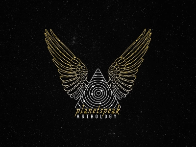

# astrology-app


```bash
git clone https://github.com/MaxEpam2015/astrology-app.git
```

## Prerequisites for building project just by 1 command:
#### OS - mac m2
#### Docker Engine v25.0.3 
#### installed php >=8.2

# Building project command:

```bash
make i
```

# Manually building project:


```bash
make up
```

## Composer installation:
```bash
composer i 
```

### Copy .env.example variables to .env:
```bash
docker exec -it astro_php-fpm bash 
cp -v .env.example .env
```

### Test db creation:
```bash
docker exec -it  mysql bash
mysql -uroot -p
CREATE DATABASE astro_db_test;
```

# Other available commands

```text
Possible commands are:
  - make up            : docker-compose up -d
  - make down          : docker-compose down
  - make docker-build  : docker-compose up --build -d
  - make test          : docker-compose exec php-cli vendor/bin/phpunit
  - make queue         : docker-compose exec php-cli php artisan queue:work
  - make perm          : sudo chmod -R ug+rwx storage bootstrap/cache
  - make script        : cp -v .env.example .env
                         cp -v .env.testing.example .env.testing
                         /usr/local/bin/composer i
                         php artisan key:generate
                         make queue

```
