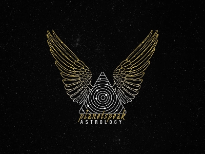

# astrology-app


## Guide for building project (Linux|Ubuntu 20.04.4):

```bash
git clone https://github.com/MaxEpam2015/astrology-app.git
```

```bash
make up
```

### If you have installed composer:
```bash
composer i 
```

```bash
cp -v .env.example .env
```

### If you have installed "php": "^8.0":
```bash
php artisan key:generate
```

### Else:
```bash
docker exec -it astro_php-fpm bash 
```
```bash
php artisan key:generate
```
